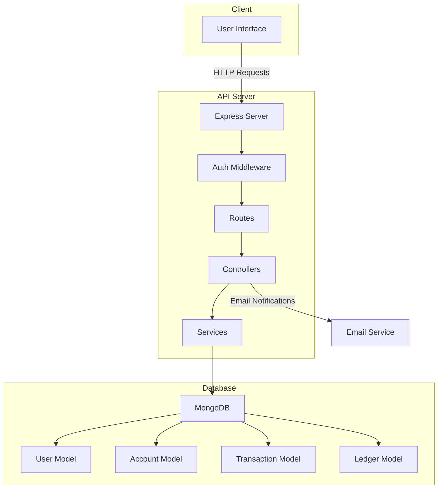

# Advance Back

A Node.js and Express backend for a ledger-style banking workflow. The project handles user authentication, account creation, idempotent money transfers, ledger entry generation, and email notifications for selected events.

## Overview

This API is built around four main areas:

- Authentication for user registration and login
- Accounts for creating user-owned banking profiles
- Transactions for moving funds between accounts
- Ledger entries for maintaining an audit trail

MongoDB is used for persistence through Mongoose models, and JWT protects private routes.

## System Architecture



## Tech Stack

- Node.js
- Express
- MongoDB + Mongoose
- JWT authentication
- bcryptjs
- cookie-parser
- Nodemailer

## Project Structure

```text
advance_back/
|-- src/
|   |-- app.js
|   |-- config/
|   |   `-- db.js
|   |-- controllers/
|   |   |-- account.controller.js
|   |   |-- auth.controller.js
|   |   `-- transaction.controller.js
|   |-- middleware/
|   |   `-- auth.middleware.js
|   |-- models/
|   |   |-- account.model.js
|   |   |-- ledger.model.js
|   |   |-- transaction.model.js
|   |   `-- user.model.js
|   |-- routes/
|   |   |-- account.js
|   |   |-- auth.routes.js
|   |   `-- transaction.routes.js
|   `-- services/
|       `-- email.service.js
|-- server.js
|-- package.json
`-- README.md
```

## Core Flow

### Authentication

- `POST /api/auth/register` creates a new user
- `POST /api/auth/login` verifies credentials and issues a JWT
- The token can be used through:
  - a cookie named `token`
  - an `Authorization: Bearer <token>` header

### Account Creation

- `POST /api/accounts` creates an account for the authenticated user
- Each account stores owner, status, and currency details

### Transaction Processing

- `POST /api/transactions` creates a transfer between two accounts
- Each request must include an `idempotencyKey`
- A successful transfer writes:
  - one transaction record
  - one debit ledger entry
  - one credit ledger entry

### System Funding

- `POST /api/transactions/system/initial-funds` is reserved for a system user
- It is intended to seed funds using the same ledger-based flow

## Environment Variables

Create a `.env` file in the project root:

```env
PORT=3000
MONGO_URI=mongodb://127.0.0.1:27017/advance_back
JWT_SECRET_KEY=replace_with_a_secure_secret

EMAIL_USER=your_email@example.com
CLIENT_ID=your_google_oauth_client_id
CLIENT_SECRET=your_google_oauth_client_secret
REFRESH_TOKEN=your_google_oauth_refresh_token
```

Notes:

- `PORT` is optional. The app falls back to `3000`.
- Email delivery currently uses Gmail OAuth2.

## Installation

```bash
npm install
```

## Run Locally

```bash
npm run dev
```

Server URL:

```text
http://localhost:3000
```

Or the port set in `PORT`.

## API Reference

### Register

`POST /api/auth/register`

```json
{
  "name": "Devansh",
  "email": "devansh@example.com",
  "password": "password123"
}
```

### Login

`POST /api/auth/login`

```json
{
  "email": "devansh@example.com",
  "password": "password123"
}
```

### Create Account

`POST /api/accounts`

Headers:

```text
Authorization: Bearer <jwt_token>
```

### Create Transaction

`POST /api/transactions`

```json
{
  "fromAccount": "ACCOUNT_ID",
  "toAccount": "ACCOUNT_ID",
  "amount": 500,
  "idempotencyKey": "txn-unique-001"
}
```

### Create Initial Funds

`POST /api/transactions/system/initial-funds`

```json
{
  "toAccount": "ACCOUNT_ID",
  "amount": 10000,
  "idempotencyKey": "seed-unique-001"
}
```

This route requires a user with the `systemUser` flag enabled.

## Auth Middleware

The middleware in [src/middleware/auth.middleware.js](/d:/advance_back/src/middleware/auth.middleware.js) does the following:

- reads JWT from cookies or bearer header
- verifies the token with `JWT_SECRET_KEY`
- loads the user document from MongoDB
- attaches the user to `req.user`

The system-only middleware performs an additional `systemUser` authorization check.

## Ledger Design

The ledger is designed to be append-only:

- every movement is stored as `credit` or `debit`
- balances are derived from ledger entries instead of being stored directly
- update and delete operations are blocked at the model level

## Current Limitations

- No automated tests yet
- Request validation is still basic
- MongoDB multi-document transactions are not used yet
- Email sending is best-effort and not queued

## Scripts

```bash
npm run dev
```

## License

ISC
